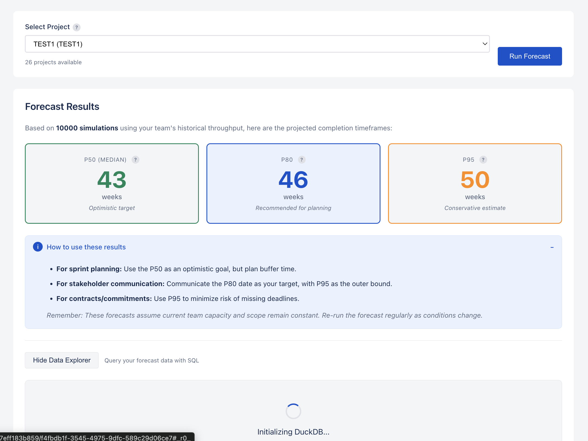

# Jira Forecast App

A Forge app for Jira that provides Monte Carlo simulation-based forecasting using client-side DuckDB for data aggregation.

## Features

- Fetch and analyze Jira issues from projects, epics, or custom JQL queries
- Compute baseline forecasts using historical throughput data
- Monte Carlo simulation with P50, P80, and P95 confidence levels
- DuckDB for efficient in-memory data processing and SQL access
- Custom UI built with React and Forge Bridge

## Prerequisites

- Node.js 18+ and npm
- Forge CLI installed globally: `npm install -g @forge/cli`
- Atlassian account with Forge access

## Installation

### 1. Install dependencies

    npm install

### 2. Build the frontend

    cd src/frontend
    npm install
    npm run build

### 3. Copy static resources

    npm run copy:static

### 4. Deploy to Forge

    forge login
    forge deploy

### 5. Install on a Jira site

    forge install

Select your Jira site when prompted.

## Development

### Build and deploy

    npm run build
    npm run deploy

### Local development with tunnel

    forge tunnel

This allows you to test changes without deploying.

### Frontend development

The frontend is in `src/frontend` and uses:
- React 18
- Forge Bridge for API communication
- Webpack for bundling
- CSS for styling (Atlassian Design System colors)

To rebuild the frontend:

    cd src/frontend
    npm run build
    npm run copy:static

## Architecture

### Backend (src/backend/)

- **fetchAndAggregate.js**: Fetches Jira issues via API and aggregates data using DuckDB
- **computeBaseline.js**: Runs Monte Carlo simulation for baseline forecast
- **computeScenario.js**: Applies scenario deltas and recomputes forecast

### Frontend (src/frontend/)

- **src/index.jsx**: Main React app with Forge Bridge integration
- **webpack.config.js**: Webpack configuration for bundling
- **public/index.html**: HTML template

### DuckDB Integration

DuckDB is used for efficient SQL-based data aggregation:
- In-memory database for fast processing
- SQL queries for throughput and remaining work calculations
- Handles large issue datasets efficiently

The DuckDB binary is included as a native Node.js module dependency.

## Manifest Configuration

The app registers as a Jira project page module with:
- Custom UI resource serving static build files
- Resolver functions for backend computation
- Permissions for reading Jira work and users

## Permissions

Required scopes:
- `read:jira-work` - Read issue data
- `read:jira-user` - Read user information

External fetch:
- `*.atlassian.net` - Call Jira REST APIs

## Troubleshooting

### DuckDB installation issues

If DuckDB fails to install, ensure you have the proper build tools:

**macOS:**
    xcode-select --install

**Linux:**
    sudo apt-get install build-essential

**Windows:**
Install Visual Studio Build Tools

### Frontend not loading

1. Check that the build completed: `ls src/frontend/build`
2. Ensure static files were copied: `ls static/build`
3. Redeploy: `forge deploy`

### Resolver errors

Check logs with:

    forge logs

Look for `[v0]` prefixed debug logs.

## License

MIT
